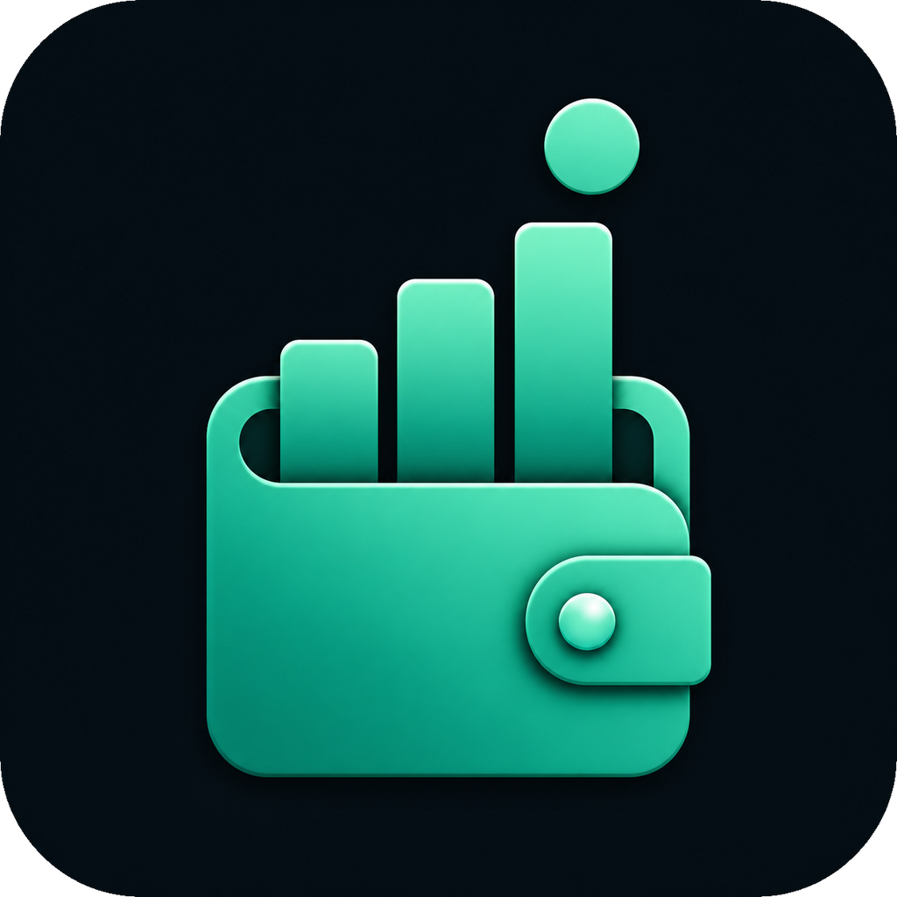
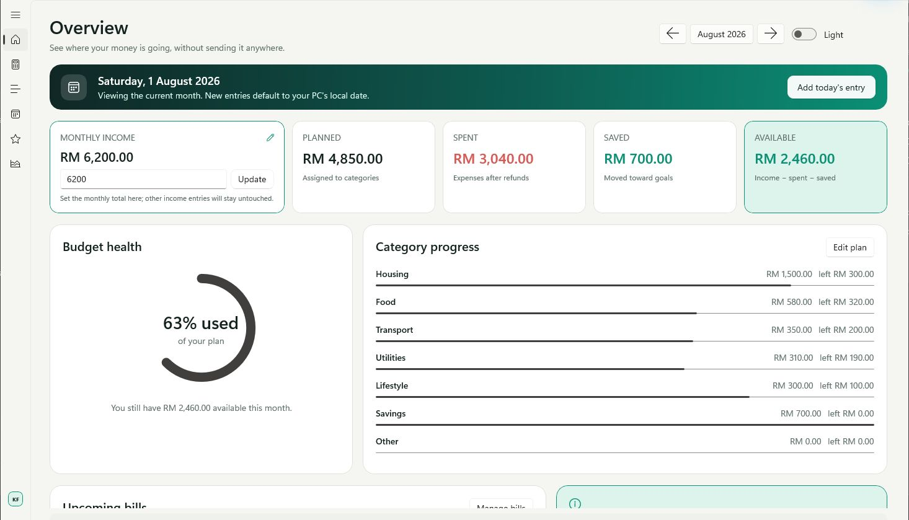
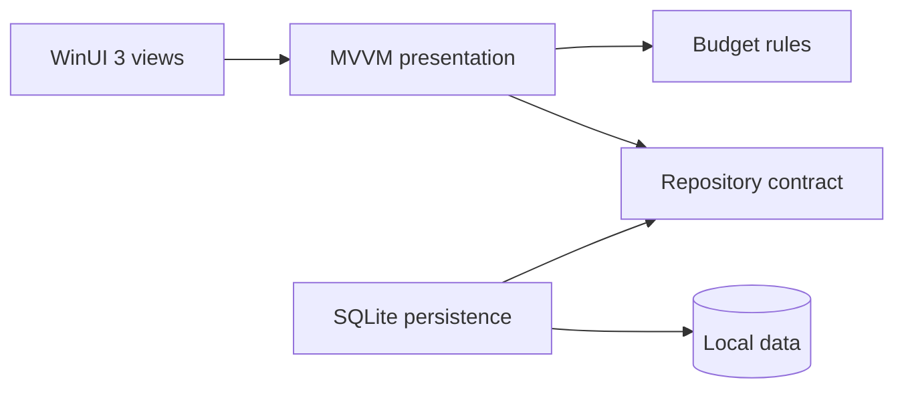

# MyBudget

<p align="center">
  
</p>

<p align="center"><strong>Personal Finance and Budget Analytics Application</strong></p>

<p align="center">
  A modern, local-first Windows app for planning a month, recording real spending,<br />
  carrying money forward, and connecting everyday savings to goals and investments.
</p>

<p align="center">
  <a href="https://github.com/KhaiFaw/mybudget-windows/actions/workflows/ci.yml"></a>
  
  
  
</p>

> [!IMPORTANT]
> MyBudget is free to download and use for **personal and other non-commercial purposes** under the [PolyForm Strict License 1.0.0](LICENSE.md). It is source-available, not open source: modification, redistribution, republication, selling, and monetization require prior written permission. Sharing a link to this official repository or its releases is welcome. See the [plain-language permission summary](COPYRIGHT.md).

## Preview

| Light overview | Dark bills |
|---|---|
|  |  |

The screenshots come from the running native WinUI app and use its built-in synthetic Malaysian-ringgit budget. They contain no personal financial information.

## What MyBudget handles

- A monthly dashboard that keeps carry-forward, income, planned money, spending, savings, and available cash distinct
- PC-local day tracking: the app opens on the current month, new entries default to today, and an open app refreshes after midnight
- Recurring monthly income with a payday, duplicate-safe automatic deposits, and per-month editing or deletion of posted income
- Automatic carry-forward that recalculates future months after an earlier transaction changes
- Editable income, expense, savings, refund, and transfer transactions, with dedicated income categories
- Category-level monthly plans and clear over-budget feedback
- Editable recurring bills, nearest-due countdowns, and safe handling for due days from the 29th to the 31st
- Savings goals that stay synchronized with linked savings transactions
- Investment tracking for Tabung Haji, ASB, Maybank Gold, and custom holdings, including contributions, valuations, gain/loss, archives, and restore
- Category and monthly reports
- Remembered light or dark mode and selectable display currencies: MYR, USD, SGD, EUR, GBP, and AUD
- Local SQLite persistence, full database backup, and transaction CSV import/export
- A synthetic example budget for safe exploration and screenshots

There is no account, advertising, analytics, telemetry, bank connection, or cloud synchronization.

## Product tour

| Screen | What it does |
|---|---|
| **Overview** | Summarizes carry-forward, recurring income, plans, spending, savings, and available cash |
| **Plan** | Sets category allocations and highlights over-budget categories |
| **Transactions** | Records, backdates, edits, and deletes money entries; routes savings to a goal or investment |
| **Bills** | Manages recurring commitments and shows the nearest due date as a day countdown |
| **Goals** | Tracks targets from starting balances plus linked savings transactions |
| **Investments** | Tracks supported and custom holdings, contributions, dated valuations, and gain/loss |
| **Reports** | Summarizes activity by category and month |
| **Settings** | Saves theme and currency preferences; provides backup, CSV, and example-data tools |

## Engineering highlights

- C# 14, .NET 10, WinUI 3, XAML, and MVVM
- Exact `decimal` money calculations
- Clear separation between UI, budget rules, and persistence
- Parameterized SQLite queries and sequential, data-preserving schema migrations
- Idempotent recurring-income synchronization, including occurrence-only deletion
- Derived carry-forward calculations that respond to historical corrections
- Destination rules that prevent one savings transaction from being counted toward both a goal and an investment
- GitHub Actions validation on Windows
- 105 automated tests: 65 budget/domain tests and 40 SQLite/schema/CSV tests



See [docs/architecture.md](docs/architecture.md) for the design decisions and [docs/requirements.md](docs/requirements.md) for the calculation rules and acceptance checks.

## Quick start from source

### Prerequisites

- Windows 10 version 1809 or later, or Windows 11
- [.NET SDK 10.0.302](https://dotnet.microsoft.com/download/dotnet/10.0), as selected by `global.json`
- Git

Clone and build the x64 app:

```powershell
git clone https://github.com/KhaiFaw/mybudget-windows.git
cd mybudget-windows
dotnet restore src/MyBudget.App/MyBudget.App.csproj -p:Platform=x64 -p:RuntimeIdentifier=win-x64
dotnet build src/MyBudget.App/MyBudget.App.csproj -c Release --no-restore -p:Platform=x64 -p:RuntimeIdentifier=win-x64
dotnet run --project src/MyBudget.App/MyBudget.App.csproj -c Release --no-build -p:Platform=x64 -p:RuntimeIdentifier=win-x64
```

MyBudget is self-contained at runtime and unpackaged, so Windows Developer Mode and a separate Windows App Runtime installation are not required.

## Test and publish locally

Run both test suites:

```powershell
dotnet test tests/MyBudget.Core.Tests/MyBudget.Core.Tests.csproj -c Release
dotnet test tests/MyBudget.Infrastructure.Tests/MyBudget.Infrastructure.Tests.csproj -c Release
```

Create a self-contained x64 folder build:

```powershell
dotnet publish src/MyBudget.App/MyBudget.App.csproj -c Release --no-restore -p:Platform=x64 -p:RuntimeIdentifier=win-x64 --self-contained true -p:PublishSingleFile=false -o artifacts/MyBudget-win-x64
```

Open `artifacts/MyBudget-win-x64/MyBudget.App.exe`. Keep the entire published folder together: copying only the EXE omits resources that WinUI needs to start.

> [!WARNING]
> Current portable builds are **unsigned**. Windows SmartScreen may therefore show an “Unknown publisher” warning, especially on another PC. Only run a build obtained from this repository's official releases or one you built from reviewed source. For a ZIP, extract the entire archive before opening the app.

Icon sources and the repeatable Windows-asset conversion command are documented in [tools/README.md](tools/README.md).

## Local data and privacy

The app stores its database under `%LOCALAPPDATA%\KhaiFaw\MyBudget`. Financial data stays on the Windows PC unless the user deliberately exports or backs it up.

The SQLite database, CSV exports, and backups are **not encrypted by MyBudget**. Protect the Windows account and device, and treat copied backup/export files as sensitive. Read [docs/privacy.md](docs/privacy.md) before entering sensitive notes or sharing a backup.

No real database, export, backup, secret, signing certificate, or build output is tracked by Git.

## Verified status

The latest verification record covers:

- **105 tests passed:** 65 core/domain tests and 40 infrastructure tests
- **Release x64 build:** zero warnings and zero errors
- **Eight native screens:** Overview, Plan, Transactions, Bills, Goals, Investments, Reports, and Settings
- Schema upgrades, recurring-income safety, carry-forward corrections, backups, CSV round trips, settings, and destination rules

See [docs/verification.md](docs/verification.md) for the dated evidence, scope, and testing limitations.

## Feedback, security, and source use

- For release history, see [CHANGELOG.md](CHANGELOG.md).
- For bug reports and feature ideas, read [CONTRIBUTING.md](CONTRIBUTING.md).
- For security concerns, follow [SECURITY.md](SECURITY.md) and avoid publishing sensitive details.
- For dependency licenses, see [THIRD-PARTY-NOTICES.md](THIRD-PARTY-NOTICES.md).
- For personal-use and source terms, read [LICENSE.md](LICENSE.md) and the [plain-language permission summary](COPYRIGHT.md).
- For commercial use, modification, or republication permission, contact the copyright holder through the [KhaiFaw GitHub profile](https://github.com/KhaiFaw).

Copyright © 2026 KhaiFaw. MyBudget is available for non-commercial use under the PolyForm Strict License 1.0.0.
