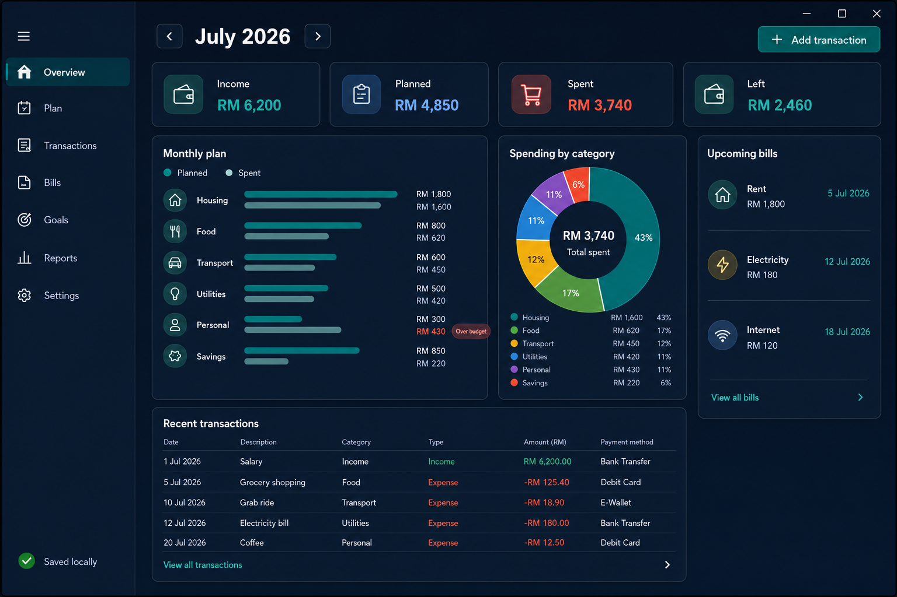

# MyBudget for Windows

MyBudget is a modern, local-first monthly budget planner built for Windows. It helps one person plan income, spending, savings, recurring bills, goals, and investments without creating an account or sending financial data to a cloud service.

> Source availability: this repository is private and proprietary. A separate public showcase is intended for portfolio viewing. See [COPYRIGHT.md](COPYRIGHT.md).

## Native app preview

| Light | Dark |
|---|---|
|  |  |

These are captures from the running native WinUI application using the built-in synthetic budget. No personal financial data is shown.


## Features

- Monthly dashboard with carry-forward, income, planned spending, actual spending, savings, and available money kept separate
- PC-local day tracking: the app opens on today, new entries default to today, and an open app follows midnight
- Recurring monthly income with an editable amount and payday; due deposits are created automatically and never duplicated by a refresh
- Automatic carry-forward that recalculates the next month's opening money when an earlier transaction changes
- Category plans with clear over-budget warnings
- Editable income, expense, savings, refund, and transfer transactions with stable income categories such as Salary and Other income
- Recurring bills with edit controls, nearest-due countdowns, and safe end-of-month handling
- Savings goals whose progress updates automatically from linked savings transactions
- Investment tracking for Tabung Haji, ASB, Maybank Gold, and user-created investments, with optional valuations, gain/loss summaries, and restorable archives
- Monthly category reports
- Persistent light and dark Windows styling
- Custom multi-resolution Windows icon for the EXE, title bar, and taskbar
- Subtle KF creator mark and KhaiFaw authorship metadata
- Local SQLite storage, explicit backup, and CSV import/export
- Optional synthetic demo data; no real financial details are committed
- No sign-in, advertising, analytics, or cloud synchronization

## Technology

- C# 14 and .NET 10 LTS
- WinUI 3 and Windows App SDK
- MVVM with CommunityToolkit.Mvvm
- SQLite through Microsoft.Data.Sqlite
- MSTest for domain and persistence tests

The solution separates the UI, money rules, and persistence:

```text
MyBudget.App  ->  MyBudget.Core
      |                   ^
      +-> MyBudget.Infrastructure
```

See [docs/architecture.md](docs/architecture.md) for the design decisions.

## Build and test

Prerequisites: Windows 10 version 1809 or later and the .NET 10 SDK. The app is built as a self-contained, unpackaged WinUI application, so Windows Developer Mode is not required.

```powershell
dotnet restore src/MyBudget.App/MyBudget.App.csproj -p:Platform=x64 -p:RuntimeIdentifier=win-x64
dotnet test tests/MyBudget.Core.Tests/MyBudget.Core.Tests.csproj -c Release
dotnet test tests/MyBudget.Infrastructure.Tests/MyBudget.Infrastructure.Tests.csproj -c Release
dotnet build src/MyBudget.App/MyBudget.App.csproj -c Release --no-restore -p:Platform=x64 -p:RuntimeIdentifier=win-x64
dotnet run --project src/MyBudget.App/MyBudget.App.csproj -c Release --no-build -p:Platform=x64 -p:RuntimeIdentifier=win-x64
dotnet publish src/MyBudget.App/MyBudget.App.csproj -c Release --no-restore -p:Platform=x64 -p:RuntimeIdentifier=win-x64 --self-contained true -p:PublishSingleFile=false -o artifacts/MyBudget-win-x64
```

The publish command creates a portable folder with `artifacts/MyBudget-win-x64/MyBudget.App.exe`. If it is distributed as a ZIP, extract the entire ZIP before opening the app, then double-click `MyBudget.App.exe` inside the extracted folder. Keep every published file and folder together; moving or copying only the EXE omits resources that WinUI needs to start. The application database is created under the current Windows user's local application-data folder. Database files, exports, backups, signing certificates, and build output are excluded from Git.

Icon sources and the repeatable Windows-asset conversion command are documented in [tools/README.md](tools/README.md).

## Privacy and limitations

The current app is local-first, but the SQLite database is not encrypted at rest. Windows account protection and device encryption remain important. Review [docs/privacy.md](docs/privacy.md) before entering sensitive notes or sharing a backup.

## Status

This is an actively developed personal portfolio project. The current Release build passes 101 automated tests, builds with zero warnings and errors, and provides eight native app screens. See [docs/verification.md](docs/verification.md) for reproducible evidence.
