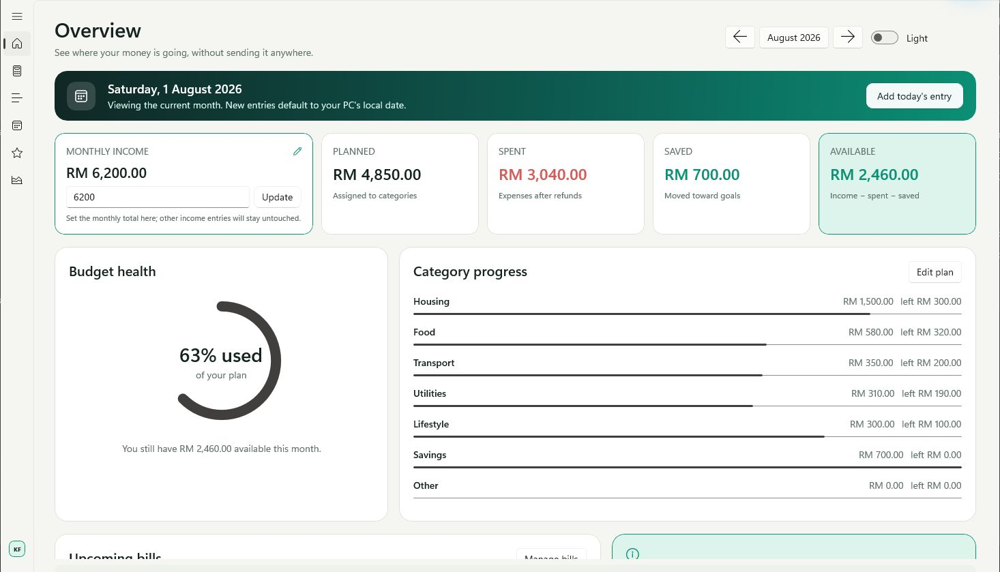
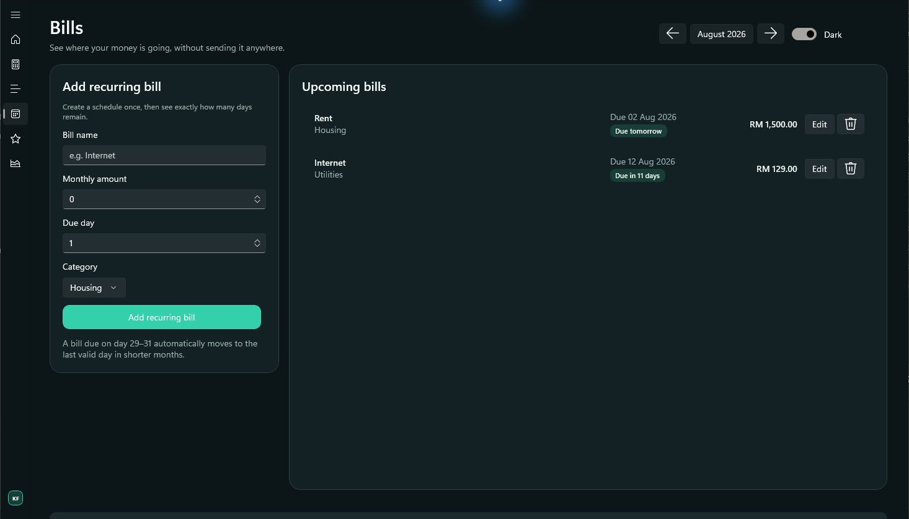
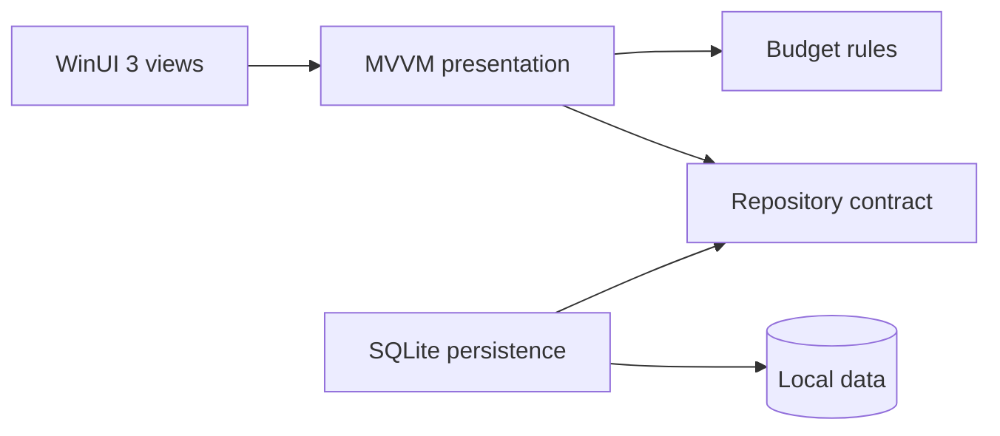

# MyBudget

<p align="center">
  
</p>

<p align="center"><strong>Personal Finance and Budget Analytics Application</strong></p>

<p align="center">
  A modern, local-first Windows app for planning a month, recording real spending,<br />
  carrying money forward, and connecting everyday savings to meaningful goals.
</p>

<p align="center">
  <a href="https://github.com/KhaiFaw/mybudget-windows/actions/workflows/ci.yml"></a>
  
  
  
</p>

> [!IMPORTANT]
> MyBudget is free to download and use for **personal and other non-commercial purposes** under the [PolyForm Strict License 1.0.0](LICENSE.md). It is source-available, not open source: modification, redistribution, republication, selling, and monetization require prior written permission. Sharing a link to this official repository or its releases is welcome. See the [plain-language permission summary](COPYRIGHT.md).

## Download and project status

[Download MyBudget 1.1.0 for Windows x64](https://github.com/KhaiFaw/mybudget-windows/releases/tag/v1.1.0). Extract the entire ZIP before opening `MyBudget.App.exe`; keep the included files together.

Active development is paused for now. The project remains available for portfolio review and personal non-commercial use. This is a personal project, not a bank-connected service; the supported statement layout and Notion setup limitations are described below.

## Preview

| Light overview | Dark bills |
|---|---|
|  |  |

These screenshots show the earlier public release. Version 1.1.0 has a quieter five-area layout. Portfolio screenshots use synthetic data only, never personal statements or salary figures.

## What MyBudget handles

- A calm Today dashboard, five primary navigation areas and entry forms that open only when needed
- PC-local day tracking: the app opens on the current month, new entries default to today, and an open app refreshes after midnight
- Recurring monthly income with a payday, duplicate-safe automatic deposits, and per-month editing or deletion of posted income
- Automatic carry-forward that recalculates future months after an earlier transaction changes
- Editable income, expense, savings, refund, and transfer transactions, with dedicated income categories
- Category-level monthly plans and clear over-budget feedback
- Private future-planning scenarios: preserved original figures, current/proposed/confirmed subscription comparisons, a separate first-month envelope, calendar food adjustments, nullable unknown costs, and actual-payslip recalculation
- Descriptive needs/wants/savings percentages with a separate buffer, pre-payday commitment cautions, and a separate 50/30/20 rule for additional recurring income
- Editable recurring bills with monthly paid checkmarks, undo, finished-month summaries, next-unpaid countdowns, and safe handling for due days from the 29th to the 31st
- Savings goals that stay synchronized with linked savings transactions
- Local Maybank savings/current-account PDF import with a review step, complete balance checks, possible-duplicate warnings and goal-linked savings
- Optional monthly-summary sharing to Notion, with a full preview before every manual send; no individual purchases or PDFs are shared
- Category and monthly reports
- Remembered light or dark mode and selectable display currencies: MYR, USD, SGD, EUR, GBP, and AUD
- Local SQLite persistence, full database backup, and transaction CSV import/export
- A synthetic example budget for safe exploration and screenshots

No MyBudget account, advertising, analytics, telemetry, AI processing, bank login or automatic cloud synchronization is required. Notion sharing is optional and manual. The manual Investments screen has been retired because no supported complete automatic holdings connection was verified; existing investment records remain in local backups.

## Product tour

| Screen | What it does |
|---|---|
| **Today** | Shows available money, income/spending/savings, bill progress and recent activity; expands the income schedule when needed |
| **Budget** | Sets category allocations and highlights over-budget categories |
| **Budget → Future plan** | Compares private estimates without posting income or spending; preserves the original baseline and accepts actual payslip figures later |
| **Activity** | Records, backdates, edits, deletes and imports money entries; routes savings to a goal |
| **Bills** | Checks off each month's paid bills; shows completion and the next unpaid due date, including next month |
| **Goals** | Tracks targets from starting balances plus linked savings transactions |
| **Budget → Insights** | Summarizes activity by category and month |
| **Settings** | Theme/currency, backup, CSV, statement import, optional Notion summaries and synthetic example data |

### Import a Maybank statement

Choose **Import statement** on Today or **Import Maybank statement** in Activity. Select a complete statement PDF or paste its local file path. After validation, select the rows you want, review types/categories and possible duplicates, and confirm. Savings can be linked directly to goals. The opening balance is **not** automatically treated as income, and bills are not automatically marked paid.

The importer supports the tested Maybank savings-account signed-amount layout and structurally matching current-account statements. Scans, credit-card statements and other layouts are not yet supported. Unsupported or unbalanced documents add nothing. This is local statement import, not a live bank connection. See [privacy and safeguards](docs/privacy.md).

### Send a monthly summary to Notion

In **Settings → Notion · Monthly summaries**, follow the linked Notion setup guide, grant an internal connection access to a dedicated parent page, and save its page link and token inside the app. Choose the month, preview the complete totals, then explicitly send. The credential is encrypted for your Windows user, never embedded in the application or Git. A subsequent send updates the same month's app-owned summary block and leaves unrelated page content alone. No live connection is preconfigured in the downloadable app.

## Engineering highlights

- C# 14, .NET 10, WinUI 3, XAML, and MVVM
- Exact `decimal` money calculations
- Clear separation between UI, budget rules, and persistence
- Parameterized SQLite queries and sequential, data-preserving schema migrations
- Idempotent recurring-income synchronization, including occurrence-only deletion
- Derived carry-forward calculations that respond to historical corrections
- Destination rules that prevent one savings transaction from being counted toward both a goal and an investment
- GitHub Actions validation on Windows
- 185 automated checks: 100 domain/privacy rules and 85 persistence/import/connection checks (one private-PDF integration check is opt-in and is skipped without a local fixture)


```mermaid
flowchart LR
    UI["WinUI 3 views"] --> VM["MVVM presentation"]
    VM --> CORE["Budget rules"]
    VM --> CONTRACT["Repository contract"]
    SQLITE["SQLite persistence"] --> CONTRACT
    SQLITE --> LOCAL[("Local data")]
```

See [docs/architecture.md](docs/architecture.md) for the design decisions and [docs/requirements.md](docs/requirements.md) for the calculation rules and acceptance checks.

## Quick start from source

### Prerequisites

- Windows 10 version 1809 or later, or Windows 11
- [.NET SDK 10.0.302](https://dotnet.microsoft.com/download/dotnet/10.0), as selected by `global.json`
- Git

Clone and build the x64 app:

```powershell
git clone https://github.com/KhaiFaw/mybudget-windows.git
cd mybudget-windows
dotnet restore src/MyBudget.App/MyBudget.App.csproj -p:Platform=x64 -p:RuntimeIdentifier=win-x64
dotnet build src/MyBudget.App/MyBudget.App.csproj -c Release --no-restore -p:Platform=x64 -p:RuntimeIdentifier=win-x64
dotnet run --project src/MyBudget.App/MyBudget.App.csproj -c Release --no-build -p:Platform=x64 -p:RuntimeIdentifier=win-x64
```

MyBudget is self-contained at runtime and unpackaged, so Windows Developer Mode and a separate Windows App Runtime installation are not required.

## Test and publish locally

Run both test suites:

```powershell
dotnet test tests/MyBudget.Core.Tests/MyBudget.Core.Tests.csproj -c Release
dotnet test tests/MyBudget.Infrastructure.Tests/MyBudget.Infrastructure.Tests.csproj -c Release
```

Create a self-contained x64 folder build:

```powershell
dotnet publish src/MyBudget.App/MyBudget.App.csproj -c Release --no-restore -p:Platform=x64 -p:RuntimeIdentifier=win-x64 --self-contained true -p:PublishSingleFile=false -o artifacts/MyBudget-win-x64
```

Open `artifacts/MyBudget-win-x64/MyBudget.App.exe`. Keep the entire published folder together: copying only the EXE omits resources that WinUI needs to start.

> [!WARNING]
> Current portable builds are **unsigned**. Windows SmartScreen may therefore show an “Unknown publisher” warning, especially on another PC. Only run a build obtained from this repository's official releases or one you built from reviewed source. For a ZIP, extract the entire archive before opening the app.

Icon sources and the repeatable Windows-asset conversion command are documented in [tools/README.md](tools/README.md).

## Local data and privacy

The app stores its database under `%LOCALAPPDATA%\KhaiFaw\MyBudget`. Financial data stays on the Windows PC unless the user deliberately exports, backs it up, or sends a previewed monthly summary to Notion.

Optional planning figures live in `planning-profile.json` beside the database, with previous versions in `planning-history`. They are not shipped in the app or stored in the public source. A planning scenario never creates a transaction or assumes an unknown amount is zero. See [private planning scenarios](docs/planning.md) for the profile format and calculation assumptions.

The SQLite database, private planning profiles/history, CSV exports, and backups are **not encrypted by MyBudget**. Protect the Windows account and device, and treat copied backup/export files as sensitive. Read [docs/privacy.md](docs/privacy.md) before entering sensitive notes or sharing a backup.

No real database, export, backup, secret, signing certificate, or build output is tracked by Git.

## Verified status

The latest verification record covers:

- **185 checks passed locally:** 100 core/domain tests and 85 infrastructure checks, including an optional private-PDF validation (184 pass and one is skipped without that fixture)
- **Release x64 build:** zero warnings and zero errors
- **Five daily areas:** Today, Activity, Bills, Budget and Goals, plus nested Future plan/Insights and Settings
- Schema upgrades, recurring-income safety, carry-forward corrections, backups, CSV round trips, settings, and destination rules

See [docs/verification.md](docs/verification.md) for the dated evidence, scope, and testing limitations.

## Feedback, security, and source use

- For release history, see [CHANGELOG.md](CHANGELOG.md).
- For bug reports and feature ideas, read [CONTRIBUTING.md](CONTRIBUTING.md).
- For security concerns, follow [SECURITY.md](SECURITY.md) and avoid publishing sensitive details.
- For dependency licenses, see [THIRD-PARTY-NOTICES.md](THIRD-PARTY-NOTICES.md).
- For personal-use and source terms, read [LICENSE.md](LICENSE.md) and the [plain-language permission summary](COPYRIGHT.md).
- For commercial use, modification, or republication permission, contact the copyright holder through the [KhaiFaw GitHub profile](https://github.com/KhaiFaw).

Copyright © 2026 KhaiFaw. MyBudget is available for non-commercial use under the PolyForm Strict License 1.0.0.
