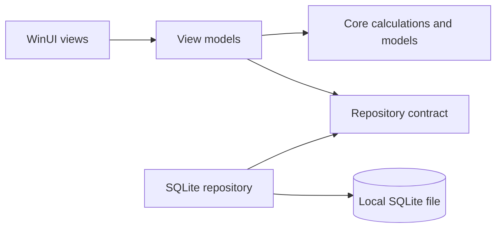

# Architecture

MyBudget uses three projects so each kind of decision can be tested independently.

## Projects

- `MyBudget.Core` contains money rules, month handling, models, and repository contracts. It has no UI or database dependency.
- `MyBudget.Infrastructure` implements the repository contract with SQLite, CSV, and backups.
- `MyBudget.App` contains WinUI views and MVVM presentation logic. It composes the other two projects.

## Data choices

- IDs are stable integers for built-in categories and GUIDs for user activity.
- Money is represented as `decimal` in C# and invariant text in SQLite to preserve exact base-10 values.
- Dates are ISO-8601 text and transactions are selected by a half-open monthly range.
- SQL is parameterized.
- Schema creation and sequential upgrades run inside the repository initialization path. The version-two migration preserves existing transactions and goals while adding recurring income, savings destinations, investments, and valuations; version three adds recurring-income occurrence suppressions.
- Carry-forward is derived from historical transaction cash flow instead of being copied into a second editable balance, so historical corrections flow into every later month.
- Recurring-income occurrences have deterministic source-and-month identities. Synchronization is idempotent and concurrency-safe, and disabling a schedule keeps its posted history. Deleting one posted occurrence records a schedule-and-month suppression so synchronization cannot recreate it while later scheduled deposits remain due.
- Goal and investment totals are derived from linked savings transactions. A destination rule prevents a transaction from linking to both at once or linking a non-savings transaction.
- Investment value is an as-of-month view: contributions provide the fallback value, and the latest eligible dated valuation provides the displayed market value and gain/loss. Saving an investment and its valuation is one atomic database operation.

## UI choices

- A `NavigationView` keeps the eight major areas predictable: Overview, Plan, Transactions, Bills, Goals, Investments, Reports, and Settings.
- The dashboard distinguishes savings from spending; this prevents saving money from looking like an expense.
- Local dates stay as `DateOnly` values, so a due-date countdown cannot drift because of UTC offsets or daylight-saving changes.
- The income schedule records its amount, payday, active state, and optional lifetime separately from generated income transactions. A daily synchronization materializes only deposits due on or before the PC-local date.
- Transaction editing upserts the original GUID, so corrections do not create a duplicate or lose a goal or investment destination.
- Posted recurring-income entries are managed from Transactions. Editing preserves the occurrence identity, while deletion removes only the selected deposit and leaves the schedule unchanged.
- Income categories are first-class category records, allowing Salary and Other income to remain distinct from expense and savings categories.
- Goals combine a user-entered starting amount with recalculated linked savings, while the Investments view combines linked contributions with dated valuations.
- Theme resources provide semantic colors so one interface supports both accessible light and dark modes.
- Views call commands on a view model; calculations remain in the core project.

For visual testing and portfolio captures, `MYBUDGET_DATA_DIRECTORY` can point the app at an isolated synthetic database. Normal launches ignore that override and continue to use `%LOCALAPPDATA%\KhaiFaw\MyBudget`.

## Recovery and portability

The database backup command creates a consistent SQLite copy. CSV is available for transaction portability and includes goal and investment destination names, while a full database backup preserves schedules, goals, investments, valuations, and all other supported data. Neither format is encrypted by MyBudget, so the user controls where copies are stored and shared.
