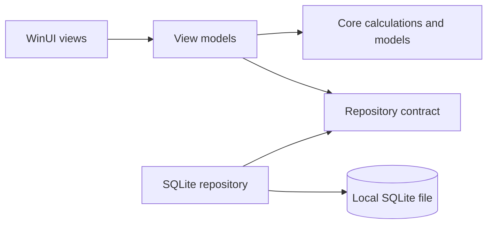

# Architecture

MyBudget uses three projects so each kind of decision can be tested independently.

## Projects

- `MyBudget.Core` contains money rules, month handling, models, and repository contracts. It has no UI or database dependency.
- `MyBudget.Infrastructure` implements the repository contract with SQLite, CSV, and backups.
- `MyBudget.App` contains WinUI views and MVVM presentation logic. It composes the other two projects.

## Data choices

- IDs are stable integers for built-in categories and GUIDs for user activity.
- Money is represented as `decimal` in C# and invariant text in SQLite to preserve exact base-10 values.
- Dates are ISO-8601 text and transactions are selected by a half-open monthly range.
- SQL is parameterized.
- Schema creation and upgrades run inside the repository initialization path.

## UI choices

- A `NavigationView` keeps the major areas predictable.
- The dashboard distinguishes savings from spending; this prevents saving money from looking like an expense.
- Local dates stay as `DateOnly` values, so a due-date countdown cannot drift because of UTC offsets or daylight-saving changes.
- The editable income card owns one identifiable monthly-income transaction and leaves imported or separately entered income untouched.
- Theme resources provide semantic colors so one interface supports both accessible light and dark modes.
- Views call commands on a view model; calculations remain in the core project.

For visual testing and portfolio captures, `MYBUDGET_DATA_DIRECTORY` can point the app at an isolated synthetic database. Normal launches ignore that override and continue to use `%LOCALAPPDATA%\KhaiFaw\MyBudget`.

## Recovery and portability

The database backup command creates a consistent SQLite copy. CSV is available for transaction portability, while a full database backup preserves all supported data. Neither format is encrypted by MyBudget, so the user controls where copies are stored and shared.
