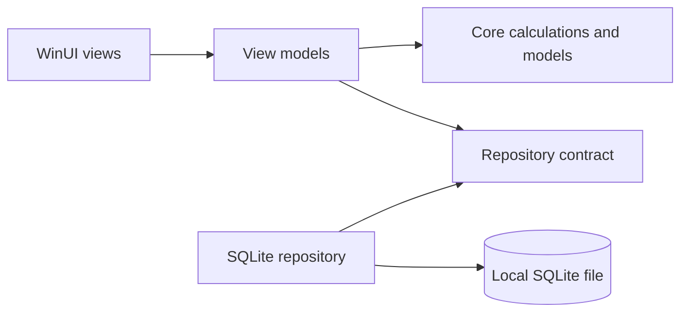

# Architecture

MyBudget uses three projects so each kind of decision can be tested independently.

## Projects

- `MyBudget.Core` contains money rules, month handling, models, and repository contracts. It has no UI or database dependency.
- `MyBudget.Infrastructure` implements SQLite, CSV, backups, strict local Maybank PDF parsing and the optional Notion summary client.
- `PlanningProfileStore` separately stores nullable estimates, the immutable original comparison and user-supplied payslip figures as local JSON with atomic replacement and previous-version copies. It never writes to the transaction repository.
- `MyBudget.App` contains WinUI views and MVVM presentation logic. It composes the other two projects.

```mermaid
flowchart LR
    UI["WinUI views"] --> VM["View models"]
    VM --> CORE["Core calculations and models"]
    VM --> CONTRACT["Repository contract"]
    SQLITE["SQLite repository"] --> CONTRACT
    SQLITE --> DB[("Local SQLite file")]
```

## Data choices

- IDs are stable integers for built-in categories and GUIDs for user activity.
- Money is represented as `decimal` in C# and invariant text in SQLite to preserve exact base-10 values.
- Dates are ISO-8601 text and transactions are selected by a half-open monthly range.
- SQL is parameterized.
- Schema creation and sequential upgrades run inside the repository initialization path. The version-two migration preserves existing transactions and goals while adding recurring income, savings destinations, investments, and valuations; version three adds recurring-income occurrence suppressions; version four adds bill payment history.
- Bill completion is keyed by bill ID and **due month**, independently of the date it was paid. Marking is idempotent; undo affects only that occurrence. Saved amount/due-date snapshots survive schedule edits, and normal database backups preserve payment history. This checklist does not create or delete expense transactions.
- Payment tracking begins in the upgrade month for existing bills, or the selected creation month for new bills. Earlier payment history is unknown, not assumed unpaid. From that starting point, the next-unpaid calculation retains overdue bills across calendar changes and skips every paid occurrence. Historical months remain available for manual review.
- Carry-forward is derived from historical transaction cash flow instead of being copied into a second editable balance, so historical corrections flow into every later month.
- Recurring-income occurrences have deterministic source-and-month identities. Synchronization is idempotent and concurrency-safe, and disabling a schedule keeps its posted history. Deleting one posted occurrence records a schedule-and-month suppression so synchronization cannot recreate it while later scheduled deposits remain due.
- Goal and investment totals are derived from linked savings transactions. A destination rule prevents a transaction from linking to both at once or linking a non-savings transaction.
- Investment value is an as-of-month view: contributions provide the fallback value, and the latest eligible dated valuation provides the displayed market value and gain/loss. Saving an investment and its valuation is one atomic database operation.

## UI choices

- A responsive `NavigationView` has five primary areas: Today, Activity, Bills, Budget and Goals. Future plan and Insights are nested under Budget; Settings contains optional connections and data tools. Startup opens Today even when a private planning profile exists. Entry forms are collapsed until needed and editing opens the relevant form.
- Future plan evaluates `PlanningCalculator` scenarios independently of received income and spending. A cautious first-month envelope is not treated as an employment/payroll proration formula. Missing costs, deductions, opening balances and holdings remain null. The original full-month current-cost column survives later estimate and payslip changes.
- The dashboard distinguishes savings from spending; this prevents saving money from looking like an expense.
- Local dates stay as `DateOnly` values, so a due-date countdown cannot drift because of UTC offsets or daylight-saving changes.
- The income schedule records its amount, payday, active state, and optional lifetime separately from generated income transactions. A daily synchronization materializes only deposits due on or before the PC-local date.
- Transaction editing upserts the original GUID, so corrections do not create a duplicate or lose a goal or investment destination.
- Posted recurring-income entries are managed from Transactions. Editing preserves the occurrence identity, while deletion removes only the selected deposit and leaves the schedule unchanged.
- Income categories are first-class category records, allowing Salary and Other income to remain distinct from expense and savings categories.
- Goals combine a user-entered starting amount with recalculated linked savings. The manual Investments view is retired; its data model, saved history and legacy transaction links remain intact. New savings entries offer goals or general savings, while editing a legacy entry preserves its existing investment link.
- Theme resources provide semantic colors so one interface supports both accessible light and dark modes.
- Views call commands on a view model; calculations remain in the core project.

For visual testing and portfolio captures, `MYBUDGET_DATA_DIRECTORY` can point the app at an isolated synthetic database. Normal launches ignore that override and continue to use `%LOCALAPPDATA%\KhaiFaw\MyBudget`.

## Local statement imports and optional sharing

`MaybankStatementReader` extracts positioned words with PdfPig, restricts parsing to the recognized ledger columns and notes boundary, carries descriptions across page breaks, verifies each signed amount against the running balance, and reconciles opening/closing balances and credit/debit totals. Unknown layouts fail closed. File/page/word/row limits bound ordinary input size; parsing runs off the UI thread. No raw statement is saved, logged or uploaded.

Stable imported GUIDs derive from a SHA-256 digest of bank/account/date/signed amount/running balance/occurrence. They are independent of later note/category/amount edits. The review UI distinguishes exact IDs from possible manual/scheduled duplicates, restricts types to the cash direction, validates categories and can link outgoing savings to a goal. `ImportStatementEntriesAsync` validates the entire batch, then inserts new IDs in one SQLite transaction without upserting existing IDs. It never copies statement balances into income or changes bill-payment state.

`MonthlySummary.Create` is an explicit aggregate allowlist. `NotionSummaryClient` only accepts this text object, a parent page ID and a token; it never receives a full snapshot, transaction list or PDF. Requests go only to the fixed HTTPS API host with redirects disabled. The client paginates child pages, creates or updates the one app-owned month paragraph, rejects ambiguous ownership and avoids retrying ambiguous writes. Fake HTTP tests cover the protocol without network calls. Windows user-scoped protection stores the token outside SQLite. Every actual send requires an in-app preview and confirmation; there is no background task or two-way sync.

## Recovery and portability

The database backup command creates a consistent SQLite copy. CSV is available for transaction portability and includes goal and investment destination names, while a full database backup preserves schedules, goals, investments, valuations, and all other supported data. Neither format is encrypted by MyBudget, so the user controls where copies are stored and shared.

Private planning JSON and `planning-history` are deliberately separate from database backups and CSV exports. Back them up separately from the app-data folder. They are not encrypted and must never be included in a public release or real-data screenshot. See [planning.md](planning.md).
